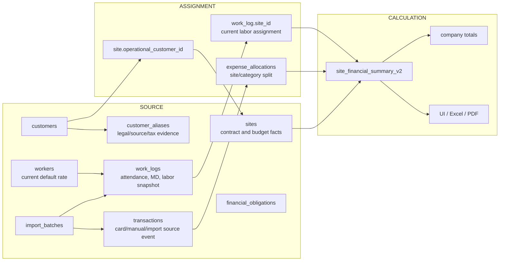

# Domain Model V2

## Scope and evidence

This is a design-only target model. It was derived from Production read-only catalog queries on 2026-09-03 and the current `9c8155e` repository. Production has `customers`, `sites`, `workers`, `work_logs`, `transactions`, and `checklists`; all have UUID primary keys and RLS enabled, but there are no foreign keys. `work_logs.site_id`, `work_logs.worker_id`, and `transactions.site_id` are TEXT. Current normalized-name unique indexes make site/worker/customer names identifiers, and business-key unique indexes exist on work logs and transactions. Current policies permit broad public or anon/authenticated CRUD rather than organization/site authorization.

The frontend loads all six tables into one cached `AppState`, calculates labor from current `workers.daily`, and synchronizes state by whole-list upsert plus hard delete. Expense/work-log imports deduplicate using fragile display tuples; import functions can delete entire tables. Those paths are compatibility inputs, not the target model.

## Core model

Source records preserve what occurred. Assignment records say where and how it counts. Calculation is disposable and reproducible from active source plus confirmed assignment. Reassigning a site or category never edits card approval evidence.

## Entity semantics

### Sites

`sites` is a contract/profit unit, not a physical address. Existing `id` UUIDs remain unchanged. `site_code` becomes the business identity and is unique; `name` becomes a non-unique display label. `operational_customer_id` points to the standard customer. `contract_supply_amount` is the unambiguous successor to `budget`; `cost_budget_amount` is nullable and is never synthesized from contract value or zero. Optional `physical_location_name` and `site_group_key` support grouping without creating a physical-site identity table.

Protected pairs such as S017/S091, S064/S147, S065/S132, S067/S068, S090/S106, S111/S150, and S148/S167 remain independent even when display names match. S067 contains the regular Yeosu repair scope; S068 is the independent projecting-balcony steel cutting/drilling job. The word “Yeosu” alone never assigns a source to S068.

### Customers and aliases

`customers` stores operational standard customers. `customer_aliases` preserves source, legal, tax-invoice, and operational variants. For Yeosu, 삼표피앤씨 can be operational while 삼표피앤씨 주식회사, 건성, 성보산업개발, and 이건테크 remain evidence aliases; an alias relationship does not rewrite original text.

### Work logs and labor

A work log retains its UUID and immutable provenance. `raw_md` is the entered/source value. `countable_md` is a derived attendance metric. New NORMAL_WORK rows snapshot the worker's current rate and store `labor_amount = daily_rate_snapshot × raw_md` with `labor_source=CALCULATED`. Existing canonical historical rows use `HISTORICAL_IMPORT`, so later worker-rate changes cannot alter their labor.

HOLIDAY has zero countable MD, zero labor, and no cost scope. OTHER has zero countable MD; documented historical payment may be preserved as overhead. When a CALCULATED row's MD changes, its stored snapshot—not the worker's current rate—is used. MANUAL_OVERRIDE and HISTORICAL_IMPORT require an explicit keep-or-replace labor decision.

### Transactions and allocations

`transactions` remains the source-event table and is enriched. It supports CARD, MANUAL, and IMPORT sources. `expense_allocations` becomes assignment truth and supports zero, one, or many site/category allocations. Unknown-site cards remain present as UNALLOCATED. An active allocation must be positive; the active total cannot exceed the source amount; FULL requires equality. A transaction correction is void/supersede history, not an undocumented overwrite.

Import flow is upload → parse → fingerprint → duplicate check → card/worker mapping → recommendations → preview → confirmation → append sources → append allocations. A batch and row fingerprint make replay idempotent. No flow deletes all transactions or work logs.

### Business obligations

`checklists` currently mixes task/material types and one generic status with optional payment fields. A separate `financial_obligations` entity expresses RECEIVABLE/PAYABLE direction, invoice status, settlement status, due date, split supply/VAT/total, customer, site, and raw evidence. Existing checklist workflows remain during transition.

Display buckets are deterministic: unbilled is RECEIVABLE + UNBILLED; receivable is ISSUED + UNPAID/PARTIAL; overdue adds past due date; payable is PAYABLE + UNPAID/PARTIAL.

## Financial read model

`site_financial_summary_v2` is the only reporting contract:

- actual labor = active site-scope stored labor
- actual expense = active confirmed allocations
- total cost = labor + expense
- expected profit = contract supply − total cost
- cost ratio = total cost / contract supply, except NULL/zero contract yields NULL
- budget remaining = nullable cost budget − total cost

The view must be security-invoker and governed by the caller's site authorization. UI, Excel, and PDF consume the same values. Company totals aggregate the view plus explicitly modeled overhead/unallocated buckets, so missing assignments are visible rather than silently dropped.

## Five final design decisions

### 1. Transaction table

- Decision: retain and enrich `transactions`; do not add `card_transactions`.
- Reason: it preserves UUIDs and current application/import compatibility while generalizing source events.
- Rejected alternative: a new card-only table creates two expense event paths and forces premature ID migration.
- Compatibility impact: legacy fields remain readable until enriched columns and allocation parity pass.

### 2. Manual expense

- Decision: store manual/cash/account expenses in `transactions` with `source_type=MANUAL`.
- Reason: source lifecycle, allocation, audit, and financial aggregation stay uniform.
- Rejected alternative: `manual_expenses` duplicates amount/date/category/void logic.
- Compatibility impact: today's manual UI can initially dual-write compatible transaction fields.

### 3. Physical site

- Decision: do not create `physical_sites` now; add nullable location/group attributes to `sites`.
- Reason: current evidence needs grouping, not a separately governed physical identity.
- Rejected alternative: a new table adds joins and reconciliation without an independent lifecycle.
- Compatibility impact: no UUID remap; a later extraction remains possible if shared-location governance appears.

### 4. Labor amount

- Decision: store `daily_rate_snapshot` and `labor_amount` on each work log.
- Reason: historical payroll must be stable and auditable even when defaults change.
- Rejected alternative: always deriving from `workers.daily` rewrites history.
- Compatibility impact: historical labor must be reconciled before the new read model is authoritative.

### 5. Summary strategy

- Decision: use one `site_financial_summary_v2` database view as the reporting contract.
- Reason: it prevents React/export calculation drift and supports RLS-aware reporting.
- Rejected alternative: shared frontend helpers still permit stale caches and non-React exporters to diverge.
- Compatibility impact: switch consumers only after per-site and company parity gates; use security-invoker semantics.

## Master V2 coverage

The model represents site code, operational customer, preserved source/legal customer names, contract supply, nullable cost budget, raw/countable MD, immutable historical labor, split/unallocated expenses, total cost, expected profit, and safe cost ratio. S067 and S068 have separate UUID/site_code rows, assignments, and summary rows. Canonical data is migration/reconciliation input only; after cutover Supabase is the runtime source of truth.

## Calendar and export contract

Calendar queries support date, site, customer, and worker. HOLIDAY/OTHER remain displayable but do not add countable MD. Invalid or blank dates are quarantined and never generate ghost entries or `+N` counts. Exporters receive the same summary/read-model fields as the UI and must not recreate financial formulas.
